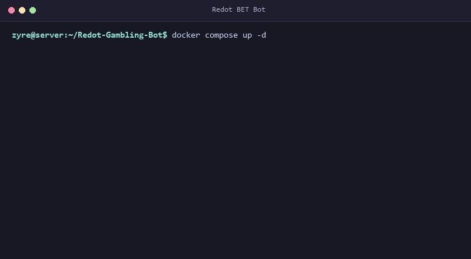

# Redot BET

A Discord casino and economy bot made with python and discord.py. Comes with 10 playable games, automatic Litecoin (LTC) deposits, and player balance saving.

<p align="center">
  
</p>

## Games Included

* **Blackjack**: Dealer hits up to 17, supports double down, hit, and stand
* **Crash**: Multiplier climbs in real time, cash out before it crashes
* **Mines**: 5x5 grid with hidden bombs, pick diamonds to boost your win
* **Roulette**: Bet on colors, numbers, or even/odd
* **Slots**: 3-reel animated slot machine
* **High-Low**: Guess if the next card is higher or lower
* **Dice**: Roll against the house
* **Coinflip**: Quick 50/50 flip
* **Wheel**: Spin for instant multipliers
* **RPS**: Rock paper scissors with tie refunds

---

## Getting Started

### Requirements
* Python 3.10+ or Docker
* A Discord bot token from the [Discord Developer Portal](https://discord.com/developers/applications) with **Message Content** and **Server Members** intents turned on.

---

### Run with Docker (Easiest)

1. Clone this repo:
   ```bash
   git clone https://github.com/zyrexdz/Redot-Gambling-Bot.git
   cd Redot-Gambling-Bot
   ```

2. Copy `.env.example` to `.env` and fill in your bot token:
   ```bash
   cp .env.example .env
   ```

3. Start it up:
   ```bash
   docker compose up -d
   ```

---

### Run Locally on your PC / VPS

1. Clone this repo:
   ```bash
   git clone https://github.com/zyrexdz/Redot-Gambling-Bot.git
   cd Redot-Gambling-Bot
   ```

2. Run the setup script:
   * **Windows**: Double click `setup.bat` (or run `setup.bat` in cmd)
   * **Linux / Mac**: Run `chmod +x setup.sh && ./setup.sh`

3. Edit `.env` and put your `DISCORD_TOKEN` inside.

4. Start the bot:
   ```bash
   python bot.py
   ```

---

## Config Settings (`.env`)

```env
DISCORD_TOKEN=your_bot_token_here
ADMIN_ROLE_ID=123456789012345678
OWNER_ID=123456789012345678
GAMBLE_CHANNEL_ID=123456789012345678
ALGO_CHANNEL_ID=123456789012345678
DEPOSIT_CHANNEL_ID=123456789012345678
LTC_ADDRESS=your_ltc_address_here
BOT_NAME=Redot BET
```

---

## Bot Permissions Needed

When inviting the bot to your server, check these boxes:
* Send Messages
* Embed Links
* Attach Files (for QR codes)
* Manage Messages (for deleting spam/commands)
* Read Message History

---

## License

MIT
